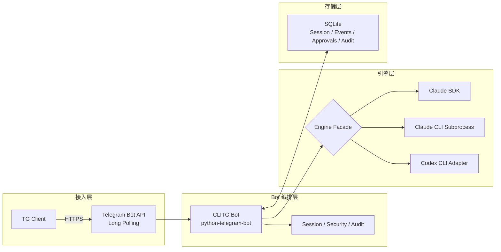

# CLITG

通过 TG（Telegram）远程操控 CLI 编码智能体的机器人，支持 Claude/Codex 双引擎、项目级会话、文件与图片输入、会话导出与安全审计。

当前实现基于 Long Polling（无需公网 IP/反向代理），核心代码入口见 `src/main.py`，命令注册见 `src/bot/core.py`。

## 核心能力

- 双引擎：`claude`（默认）+ `codex`（`/engine` 切换）
- 会话管理：按用户 + 聊天作用域 + 目录隔离
- 目录安全：仅允许 `APPROVED_DIRECTORY` 及子目录
- 文件处理：文本/代码/压缩包（含基础安全检查）
- 图片处理：支持多图输入与进度流式反馈
- 导出能力：会话可导出为 Markdown/HTML/JSON
- 安全治理：认证、审计、工具权限审批

## 架构概览



```text
TG Client -> Telegram Bot API -> CLITG Bot -> Engine Facade -> Claude/Codex
                                  |
                                  -> SQLite (Session/Event/Audit)
```

说明：
- 默认走 `USE_SDK=true` 的 Claude SDK 路径。
- SDK 遇到可重试错误时，会尝试 CLI 子进程兜底（见 `src/claude/facade.py`）。
- Codex 通过 CLI 适配接入（`ENABLE_CODEX_CLI=true`）。
- 启动命令推荐使用 `poetry run cli-tg-bot`，`poetry run claude-telegram-bot` 仅为兼容别名。

## 前置要求

- Python 3.10+（推荐 3.11）
- [Poetry](https://python-poetry.org/) 包管理
- Telegram 账号 + BotFather 创建的 Bot
- Claude CLI 已安装并认证（建议）
- 可选：Codex CLI（如需 Codex 引擎）

## 快速开始

### 1) 安装依赖

```bash
# macOS
brew install python@3.11
curl -sSL https://install.python-poetry.org | python3 -

# Claude CLI / Codex CLI 依赖 Node 环境时
brew install node
```

### 2) 安装项目

```bash
git clone <repo-url> ~/cli-tg
cd ~/cli-tg
poetry install
```

### 3) 配置 Telegram Bot

1. 在 Telegram 中打开 `@BotFather`，执行 `/newbot`
2. 获取 `TELEGRAM_BOT_TOKEN`
3. 记录 Bot 用户名（不带 `@`）
4. 向 `@userinfobot` 发送消息，获取自己的 Telegram User ID

### 4) 配置环境变量

```bash
cp .env.example .env
```

最小可用配置：

```bash
TELEGRAM_BOT_TOKEN=<BotFather token>
TELEGRAM_BOT_USERNAME=<bot username without @>
APPROVED_DIRECTORY=<absolute path>
ALLOWED_USERS=<your telegram user id>
```

推荐引擎配置（与当前代码默认一致）：

```bash
# Claude 主路径（默认）
USE_SDK=true
CLAUDE_SETTING_SOURCES=user,project,local
CLAUDE_ALLOWED_TOOLS=

# 可选：启用 Codex CLI 适配
ENABLE_CODEX_CLI=false
CODEX_CLI_PATH=
CODEX_ENABLE_MCP=false
```

说明：
- `APPROVED_DIRECTORY` 必须是已存在的绝对目录，否则启动失败。
- 必须配置 `ALLOWED_USERS`（当前认证仅支持白名单）。

### 5) 启动

```bash
make run
# 或
make run-debug
# 或
poetry run cli-tg-bot --debug
# 兼容旧别名（不推荐）
poetry run claude-telegram-bot --debug
```

## 关键配置项

完整配置请以 `.env.example` 为准，这里列常用项：

- 认证与安全
  - `ALLOWED_USERS`：白名单用户 ID（逗号分隔）
- Claude 引擎
  - `USE_SDK`：是否走 SDK
  - `CLAUDE_CLI_PATH`：CLI 路径（CLI 模式或 SDK fallback 使用）
  - `CLAUDE_MODEL` / `CLAUDE_MAX_TURNS` / `CLAUDE_TIMEOUT_SECONDS`
  - `CLAUDE_SETTING_SOURCES`：推荐 `user,project,local`；网关不兼容时可临时留空
  - `CLAUDE_ALLOWED_TOOLS`：推荐留空（不下发 `--allowedTools`，继承本机 Claude 配置）
- Codex 引擎
  - `ENABLE_CODEX_CLI`：启用 Codex 适配
  - `CODEX_CLI_PATH`：Codex 二进制路径（留空时尝试 PATH）
  - `CODEX_ENABLE_MCP`：是否允许 Codex 读取 MCP 配置
- 存储与功能
  - `DATABASE_URL`（默认 `sqlite:///data/bot.db`）
  - `ENABLE_MCP` / `MCP_CONFIG_PATH`：仅用于应用侧显式注入 MCP
  - `ENABLE_GIT_INTEGRATION` / `ENABLE_FILE_UPLOADS` / `ENABLE_QUICK_ACTIONS`

## 命令清单（与代码同步）

以下命令来源于 `src/bot/core.py` 当前注册项：

| 命令 | 说明 |
|---|---|
| `/help` | 查看完整帮助 |
| `/new` | 新建会话并清理当前上下文绑定 |
| `/resume` | 从桌面会话恢复 |
| `/engine [claude\|codex]` | 切换引擎 |
| `/context [full]` | 会话状态/用量（Claude 主命令） |
| `/status [full]` | 会话状态/用量（Codex 主命令） |
| `/model` / `/model <name\|default>` | 模型查看/切换（行为随引擎变化） |
| `/codexdiag [root\|<session_id>]` | Codex MCP 诊断（Codex 引擎） |
| `/provider` | 切换 cc-switch API 供应商（Claude 菜单显示） |
| `/cd <path>` | 切换目录（带安全校验） |
| `/ls` | 列目录 |
| `/projects` | 列出可用项目 |
| `/git` | 安全 Git 信息与快捷操作 |
| `/export` | 导出当前会话 |
| `/cancel` | 取消当前运行任务 |

补充说明：
- `/provider` 依赖本机 cc-switch（`~/.cc-switch/cc-switch.db`），且通常用于 Claude 供应商切换。
- `/resume` 会扫描桌面会话：Claude 为 `~/.claude/projects`，Codex 为 `~/.codex/sessions`（仅展示 `APPROVED_DIRECTORY` 下项目）。

## 引擎差异说明

- Claude 引擎
  - 支持 `/model` 按钮切换（sonnet/opus/haiku/default）
  - `/context` 是主状态命令（`/status` 为兼容别名）
- Codex 引擎
  - 支持 `/model <name>` 透传为 `--model`
  - `/status` 是主状态命令（`/context` 为兼容别名）
  - 支持 `/codexdiag`
  - 默认通过 `-c mcp_servers={}` 禁用 MCP（除非 `CODEX_ENABLE_MCP=true`）

## 文件与图片处理

- 文件上传
  - 默认上限约 10MB（Telegram 文档处理路径）
  - 支持文本/代码文件，压缩包支持基础提取与安全检查
- 图片上传
  - 支持单图与同组多图聚合处理
  - 当后端不支持图片输入时会返回明确提示
  - 临时图片文件存放在项目目录 `.claude-images/`（建议保持在 `.gitignore`）

## 安全模型

- 身份认证：`ALLOWED_USERS` 白名单认证
- 目录隔离：所有操作受 `APPROVED_DIRECTORY` 限制
- 输入校验：路径与命令注入关键模式拦截
- 审计与追踪：SQLite 持久化（含安全事件与审批记录）
- Git 安全：仅允许白名单只读命令子集（如 `status/log/diff/show`）

> Telegram Bot 消息会经过 Telegram 服务器中转，不适合传递高敏感密钥。

## 开发命令

```bash
make dev          # 安装开发依赖并尝试安装 pre-commit
make install      # 安装生产依赖
make run          # 启动 bot
make run-debug    # debug 启动
make test         # 运行 pytest + 覆盖率
make lint         # black/isort/flake8/mypy
make format       # 自动格式化
make clean        # 清理缓存与产物
```

## macOS 重启建议（tmux）

项目在 macOS 下推荐使用 `tmux` 守护进程重启：

```bash
tmux kill-session -t cli_tg_bot
tmux new-session -d -s cli_tg_bot -c /Users/suqi3/PycharmProjects/cli-tg './scripts/restart-bot.sh'
```

检查运行状态：

```bash
ps -Ao pid,ppid,command | rg -i 'cli-tg-bot|claude-telegram-bot|src.main' | rg -v 'rg -i'
tmux capture-pane -t cli_tg_bot -p | tail -n 80
```

## 常见问题

| 问题 | 常见原因 | 建议处理 |
|---|---|---|
| `Configuration loading failed` | 必填环境变量缺失或目录不存在 | 检查 `.env` 与 `APPROVED_DIRECTORY` |
| `No authentication providers configured` | 未配置白名单用户 | 配置 `ALLOWED_USERS` |
| `ENABLE_CODEX_CLI is true but codex binary not found` | 未安装 Codex CLI 或路径错误 | 安装 Codex CLI / 设置 `CODEX_CLI_PATH` |
| 图片提示当前引擎不支持 | 当前引擎/模式不具备图片能力 | 切到 `claude` + SDK，或使用支持 `--image` 的 Codex CLI |
| `invalid claude code request` | 部分网关与显式 setting sources 不兼容 | 临时将 `CLAUDE_SETTING_SOURCES=` 置空排障（默认推荐 `user,project,local`） |
| `/codexdiag` 无输出或超时 | 当前非 codex、无脚本、或会话日志不可用 | 先 `/engine codex`，再检查 `scripts/cc_codex_diagnose.py` |

## 参考文档

- `docs/README.md`（文档索引与权威来源说明）
- `SECURITY.md`
- `SYSTEMD_SETUP.md`
- [python-telegram-bot](https://docs.python-telegram-bot.org/)
- [Poetry](https://python-poetry.org/docs/)
